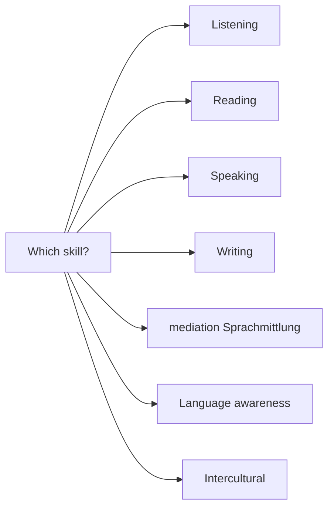

Pick a skill area, then jump to representative Units across the
fifteen courses. Generated from front-matter scans (3 representative
Units per skill).

## Listening — representative Units

[Kl.5/G+M](/track-gm/kl05/units/unit01-hello-world/) · [Kl.5/G+M](/track-gm/kl05/units/unit04-school-day/) · [Kl.5/G+M](/track-gm/kl05/units/unit07-weather-and-seasons/)

## Reading — representative Units

[Kl.5/G+M](/track-gm/kl05/units/unit03-home-and-room/) · [Kl.5/G+M](/track-gm/kl05/units/unit05-food-and-drinks/) · [Kl.5/G+M](/track-gm/kl05/units/unit06-animals-and-pets/)

## Speaking — representative Units

[Kl.5/G+M](/track-gm/kl05/units/unit01-hello-world/) · [Kl.5/G+M](/track-gm/kl05/units/unit02-my-family/) · [Kl.5/G+M](/track-gm/kl05/units/unit04-school-day/)

## Writing — representative Units

[Kl.5/G+M](/track-gm/kl05/units/unit02-my-family/) · [Kl.5/G+M](/track-gm/kl05/units/unit03-home-and-room/) · [Kl.5/G+M](/track-gm/kl05/units/unit06-animals-and-pets/)

## Mediation (Sprachmittlung) — representative Units

[Kl.7/G+M](/track-gm/kl07/units/unit08-first-mediation/) · [Kl.8/G+M](/track-gm/kl08/units/unit07-teen-magazine-mediation/) · [Kl.9/G+M](/track-gm/kl09/units/unit07-mediation-news-article/)

## Language awareness — representative Units

[Kl.5/G+M](/track-gm/kl05/units/unit01-hello-world/) · [Kl.5/G+M](/track-gm/kl05/units/unit02-my-family/) · [Kl.5/G+M](/track-gm/kl05/units/unit03-home-and-room/)

## Intercultural — representative Units

[Kl.5/G+M](/track-gm/kl05/units/unit10-a-day-in-london/) · [Kl.6/G+M](/track-gm/kl06/units/unit02-on-holiday/) · [Kl.6/G+M](/track-gm/kl06/units/unit04-food-around-the-world/)

## How to read this page

The seven branches are the skill areas every Unit declares in its front
matter. They are not a syllabus: a Unit almost always works more than one,
and the declaration names the ones it *foregrounds*, not the ones it
touches. A Unit tagged for speaking still asks learners to read, and the
listening Units still end in writing.

The three Units under each branch are drawn from a scan of that front
matter, and they are representative rather than best. They exist so that a
teacher asking "what does mediation actually look like here?" can open a
real Unit in one click instead of reading a definition of mediation.

## What each branch means here

**Listening** covers audio the learner has not seen written first. Every
Unit ships its recordings as downloadable files, so a classroom without
reliable network can still run the lesson.

**Reading** runs from single authentic artefacts — a timetable, a menu, a
short message — in Klasse 5, to literary extracts in the upper years.

**Speaking** is production in continuity: presenting, retelling,
describing. It is kept apart from interaction on purpose, because a learner
who can present fluently may still be lost in an unscripted exchange.

**Writing** always names a reader and a situation in the task. A text
without an addressee cannot be assessed honestly.

**Mediation (Sprachmittlung)** is passing on what matters from a text in one
language to somebody who needs it in another. It is not translation, and it
is assessed on relevance and adaptation to the reader rather than on
completeness.

**Language awareness** is the explicit work on how English is put together,
including the contrastive view back to German.

**Intercultural** work looks at the varieties of English and the places it
is spoken, without reducing a country to a checklist of customs.

## Sources

- *Common European Framework of Reference for Languages*, Council of Europe
  (2001), and its *Companion Volume* (2018/2020) — the activity categories
  the branches follow, including mediation.
- **Bildungsplan 2016 Baden-Württemberg** and **Bildungsplan gymnasiale
  Oberstufe 2021** — the competence areas the Units declare against.
- The Unit selections are generated from this repository's own front matter.
